What is Programming?
====================
Programming is the process of giving instructions to a computer in a language it understands.

Computers themselves only understand **machine code**, so programming languages allow humans to write instructions more easily.

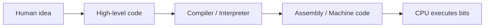

Think of it as translation layers that convert human steps into electrical signals.

<!-- column_layout: [1, 1] -->

<!-- column: 0 -->
Programming is used for:
- Automation
- Web development
- **Cybersecurity**
- Data analysis
- System administration

<!-- column: 1 -->
Real‑world examples:
- ATMs
- Browsers
- Mobile apps
- Network scanners (Nmap, etc.)

<!-- reset_layout -->

---

Why Programming Matters
=======================
Programming allows you to:
- Solve problems
- Automate repetitive tasks
- Build software
- Understand how computers actually work
- Strengthen cybersecurity skills (scripting, automation)

It is a foundational skill for modern IT and cybersecurity professionals.

---

Compilers vs Interpreters
=========================

<!-- column_layout: [1, 1] -->
<!-- column: 0 -->
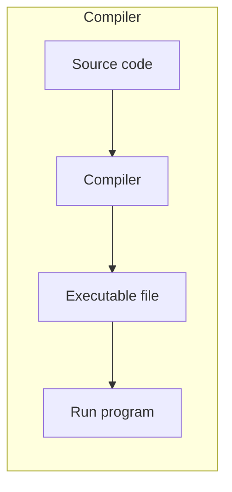
<!-- column: 1 -->
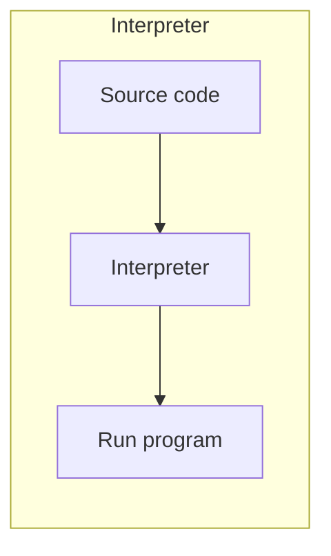

<!-- reset_layout -->

Compiler
--------
<!-- column_layout: [2, 1] -->
<!-- column: 0 -->
A **compiler** converts the entire source code into machine code **before** the program runs.

Characteristics:
- Produces a standalone executable
- Faster execution
- Errors found before running

Examples:
- C
- C++
- Go
- Rust

<!-- column: 1 -->

<!-- reset_layout -->

### Example:
`hello.c`
```c
#include <stdio.h>

int main() {
    printf("Hello, world!\n");
    return 0;
}
```
```bash
# compile
gcc hello.c -o hello
# run
chmod +x hello
./hello
# Result: Hello, world!
```
---

Interpreter
-----------
<!-- column_layout: [2, 1] -->
<!-- column: 0 -->
An **interpreter** executes code **line by line**.

Characteristics:
- More flexible
- Easier to test small parts
- Slower execution
- Errors show up while running

Examples:
- Python
- JavaScript
- Ruby

<!-- column: 1 -->

<!-- reset_layout -->

### Example:
`hello.py`
```python
print("Hello, world!")
```
```bash
# run
python hello.py
# Result: Hello, world!
```
---

Algorithms — Introduction
=========================
An **algorithm** is a step‑by‑step procedure to solve a problem.

Characteristics of good algorithms:
- Clarity
- Efficiency
- Consistency
- Finite steps

Common examples in daily life:
- Sorting items
- Making tea
- Following a recipe
- Unlocking your phone

---

Algorithm Building Blocks
=========================
All algorithms are built from a few fundamental building blocks:

1. **Sequence** — steps executed in order
2. **Selection** — making decisions (if/else)
3. **Iteration** — repeating steps (loops)
4. **Variables** — storing data
5. **Input/Output** — getting and displaying data

These building blocks can be combined to solve any computational problem.

---

Sequence
--------
<!-- column_layout: [1, 1] -->
<!-- column: 0 -->
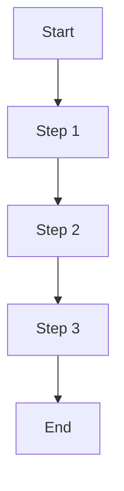
<!-- column: 1 -->
**Sequence** means executing steps one after another, in order.

Example (Making coffee):
1. Grind coffee beans
2. Boil water
3. Pour water over coffee
4. Serve

Each step must complete before the next begins.
<!-- reset_layout -->

---

Selection (Conditionals)
------------------------
<!-- column_layout: [1, 1] -->
<!-- column: 0 -->
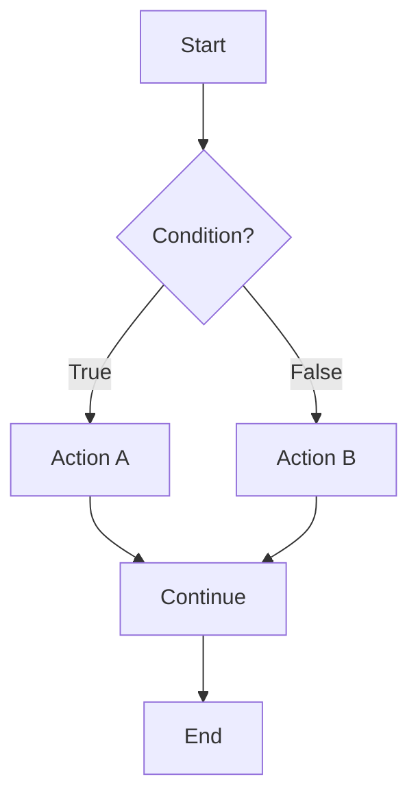
<!-- column: 1 -->
**Selection** allows algorithms to make decisions based on conditions.

Example:
```text
if temperature > 30:
    print("It's hot!")
else:
    print("It's cool!")
```

The algorithm chooses different paths based on the condition.
<!-- reset_layout -->

---

Iteration (Loops)
-----------------
<!-- column_layout: [1, 1] -->
<!-- column: 0 -->
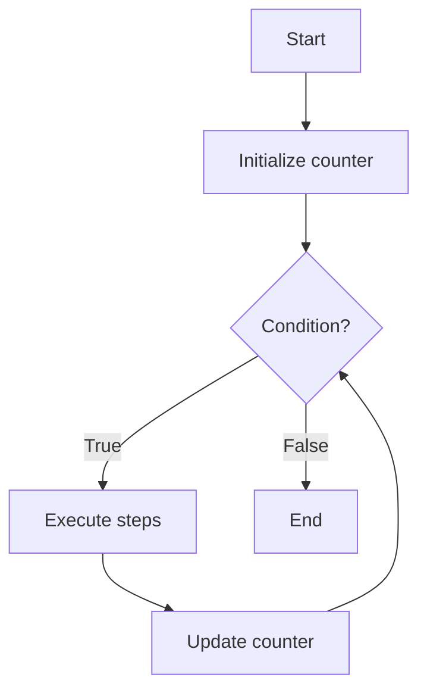
<!-- column: 1 -->
**Iteration** repeats a set of steps until a condition is met.

Example (Count to 5):
```text
count = 1
while count <= 5:
    print(count)
    count = count + 1
```

Loops help automate repetitive tasks efficiently.
<!-- reset_layout -->

---

Variables and Data Storage
--------------------------
<!-- column_layout: [1, 1] -->
<!-- column: 0 -->
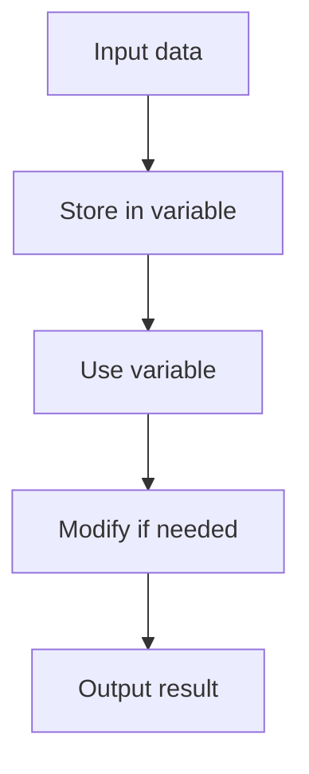
<!-- column: 1 -->
**Variables** store data that can be used and modified during algorithm execution.

Example:
```text
name = "Alice"
age = 25
message = "Hello, " + name
print(message)
```

Variables act as containers that hold values for later use.
<!-- reset_layout -->

---

Input and Output
----------------
<!-- column_layout: [1, 1] -->
<!-- column: 0 -->
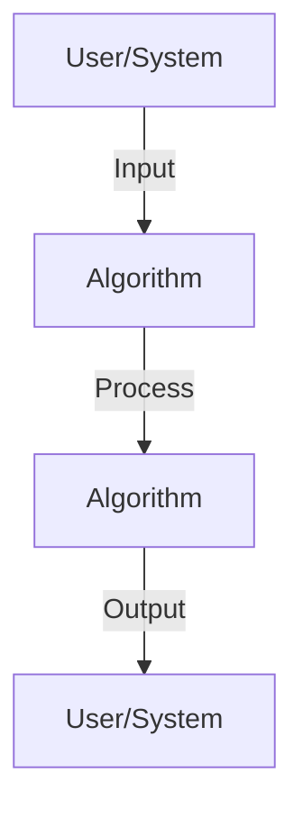
<!-- column: 1 -->
**Input** gets data from the user or system.
**Output** displays or returns results.

Example:
```text
name = input("Enter your name: ")
print("Hello, " + name)
```

Input provides data to work with; output shows the results.
<!-- reset_layout -->

---

Combining Building Blocks
-------------------------
<!-- column_layout: [1, 1] -->
<!-- column: 0 -->
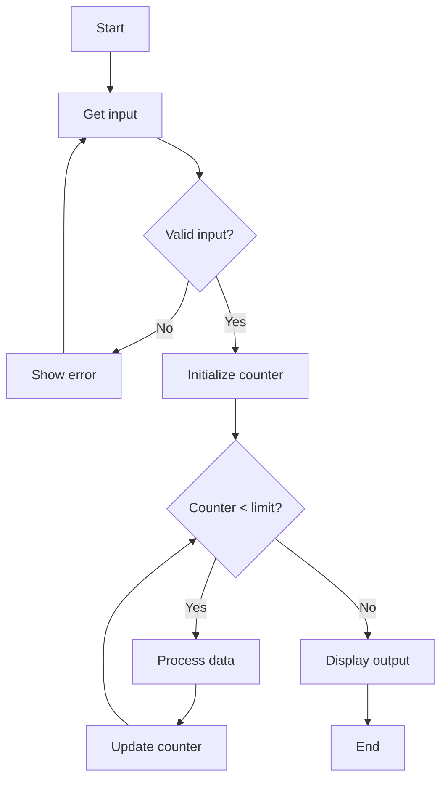
<!-- column: 1 -->
Real algorithms combine multiple building blocks:

This combines:
- **Sequence**: steps in order
- **Selection**: validation check
- **Iteration**: processing loop
- **Variables**: storing counter and data
- **Input/Output**: getting data and displaying results
<!-- reset_layout -->

---

Algorithm Examples
==================
<!-- column_layout: [1, 1] -->
<!-- column: 0 -->
**Making Tea** (Sequential Algorithm):

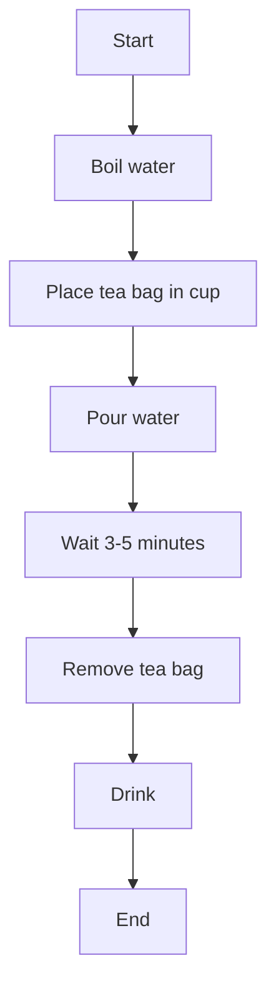
<!-- column: 1 -->
Real‑life algorithm example (Making Tea):

1. Boil water
2. Place tea bag in cup
3. Pour water
4. Wait 3–5 minutes
5. Remove tea bag
6. Drink

<!-- reset_layout -->

---

Create a Simple Algorithm — Activity
====================================
Write an algorithm for:

1. Logging into a website
2. Buying a product online
3. Starting a computer

Goal: describe steps **clearly** so that even a computer could follow them.

---

Logging into a Website — Solution
==================================
<!-- column_layout: [1, 1] -->
<!-- column: 0 -->
**Logging into a Website** (Algorithm with Selection and Iteration):

This algorithm demonstrates:
- **Sequence**: steps executed in order
- **Selection**: checking if credentials are valid
- **Iteration**: option to try again if login fails

<!-- column: 1 -->
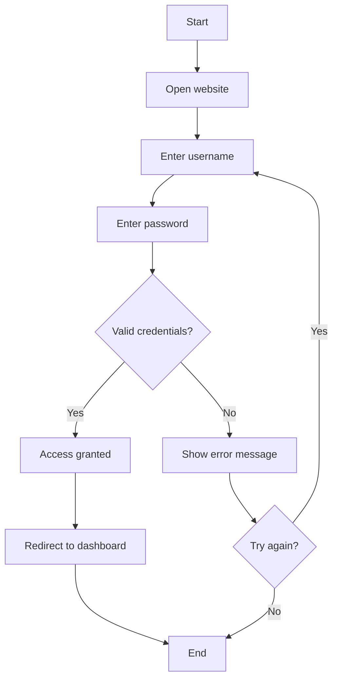

<!-- reset_layout -->

---

Algorithm Design Checklist
==========================

| Step            | Questions to ask                          |
|-----------------|-------------------------------------------|
| Inputs          | What data do I need? What format?         |
| Outputs         | What should be produced?                  |
| Steps           | In what order? Any loops or decisions?    |
| Edge cases      | What if input is missing/invalid?         |
| Representation  | Pseudocode, flowchart, or plain text?     |

Comparison:
- **Pseudocode** — quick, language-agnostic
- **Flowchart** — great for visual branching
- **Plain text** — fast brainstorming, less structure

---

Installing Python
=================
Check whether Python is installed:

```bash
python3 --version
```

Install on Linux (Debian/Ubuntu):

```bash
sudo apt update
sudo apt install python3
```

Install on macOS (Homebrew):

```bash
brew install python
```

Install on Windows:
- Use Microsoft Store
- Or download installer from python.org

Enter interactive mode (REPL):

```bash
python3
```

Exit REPL with:

```python
exit()
# or press Ctrl+D on Linux/macOS
```

---

Running Python Code
===================

Run a script file:

```bash
python3 script.py
```

Simple script example (`hello.py`):

```python
print("Hello, world!")
```

Then run:

```bash
python3 hello.py
```

---

Virtual Environments 
===============================

Later modules will install packages like `requests`, Flask, etc.

Without virtual environments:

- Different projects may **fight over versions**  
- You may not remember which scripts require which packages  

With virtual environments:

- Each project can have its **own dependencies**  
- You can safely experiment without breaking other projects  

We start using this pattern now so it feels natural later.

---

Creating and Activating a venv
==============================

Inside `projects/module1_hello/`:

```bash
python3 -m venv .venv
```

Activate it:

```bash
source .venv/bin/activate   # Linux/macOS
# or on Windows (PowerShell):
# .venv\Scripts\Activate.ps1
```

Your prompt should now show something like:

```text
(.venv) user@machine:~/.../module1_hello$
```

To deactivate later:

```bash
deactivate
```

---

Installing a Test Package
=========================

While still inside the `(.venv)`:

```bash
pip install --upgrade pip
pip install requests
pip freeze
```

You should see `requests` and its dependencies listed.

Optional: save them to `requirements.txt`:

```bash
pip freeze > requirements.txt
```

Now this project knows exactly **which versions** it uses.

---
