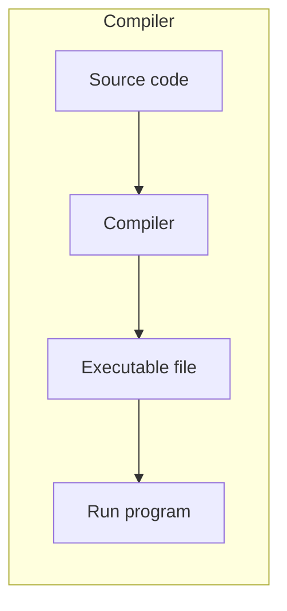
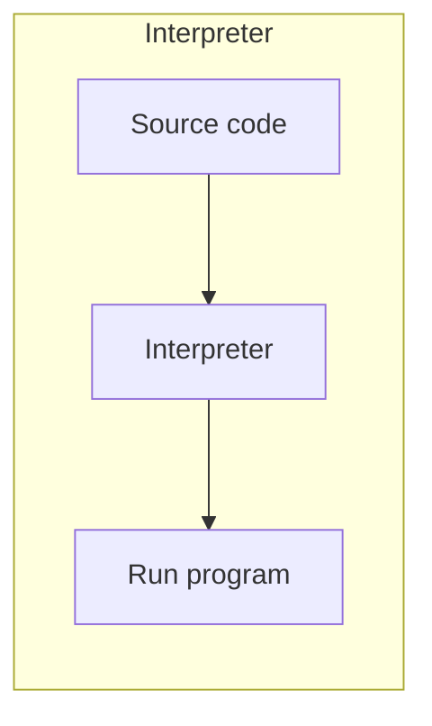

What is Programming?
====================
Programming is the process of giving instructions to a computer in a language it understands.

Computers themselves only understand **machine code**, so programming languages allow humans to write instructions more easily.

<!-- column_layout: [1, 1] -->

<!-- column: 0 -->
Programming is used for:
- Automation
- Web development
- **Cybersecurity**
- Data analysis
- System administration

<!-- column: 1 -->
Real‑world examples:
- ATMs
- Browsers
- Mobile apps
- Network scanners (Nmap, etc.)

<!-- reset_layout -->

---

Why Programming Matters
=======================
Programming allows you to:
- Solve problems
- Automate repetitive tasks
- Build software
- Understand how computers actually work
- Strengthen cybersecurity skills (scripting, automation)

It is a foundational skill for modern IT and cybersecurity professionals.

---

Compilers vs Interpreters
=========================

<!-- column_layout: [1, 1] -->
<!-- column: 0 -->

<!-- column: 1 -->


<!-- reset_layout -->

Compiler
--------
<!-- column_layout: [2, 1] -->
<!-- column: 0 -->
A **compiler** converts the entire source code into machine code **before** the program runs.

Characteristics:
- Produces a standalone executable
- Faster execution
- Errors found before running

Examples:
- C
- C++
- Go
- Rust

<!-- column: 1 -->

<!-- reset_layout -->

### Example:
`hello.c`
```c
#include <stdio.h>

int main() {
    printf("Hello, world!\n");
    return 0;
}
```
```bash
# compile
gcc hello.c -o hello
# run
chmod +x hello
./hello
# Result: Hello, world!
```
---

Interpreter
-----------
<!-- column_layout: [2, 1] -->
<!-- column: 0 -->
An **interpreter** executes code **line by line**.

Characteristics:
- More flexible
- Easier to test small parts
- Slower execution
- Errors show up while running

Examples:
- Python
- JavaScript
- Ruby

<!-- column: 1 -->

<!-- reset_layout -->

### Example:
`hello.py`
```python
print("Hello, world!")
```
```bash
# run
python hello.py
# Result: Hello, world!
```
---

Algorithms — Introduction
=========================
An **algorithm** is a step‑by‑step procedure to solve a problem.

Characteristics of good algorithms:
- Clarity
- Efficiency
- Consistency
- Finite steps

Common examples in daily life:
- Sorting items
- Making tea
- Following a recipe
- Unlocking your phone

---

Algorithm Examples
==================
Real‑life algorithm example (Making Tea):

1. Boil water
2. Place tea bag in cup
3. Pour water
4. Wait 3–5 minutes
5. Remove tea bag
6. Drink

Pseudocode example:

```text
input number
if number > 0:
    print("Positive")
else:
    print("Non-positive")
```

---

Create a Simple Algorithm — Activity
====================================
Write an algorithm for:

1. Logging into a website
2. Buying a product online
3. Starting a computer

Goal: describe steps **clearly** so that even a computer could follow them.

---

Installing Python
=================
Check whether Python is installed:

```bash
python3 --version
```

Install on Linux (Debian/Ubuntu):

```bash
sudo apt update
sudo apt install python3
```

Install on macOS (Homebrew):

```bash
brew install python
```

Install on Windows:
- Use Microsoft Store
- Or download installer from python.org

Enter interactive mode (REPL):

```bash
python3
```

Exit REPL with:

```python
exit()
# or press Ctrl+D on Linux/macOS
```

---

Running Python Code
===================

Run a script file:

```bash
python3 script.py
```

Simple script example (`hello.py`):

```python
print("Hello, world!")
```

Then run:

```bash
python3 hello.py
```

---


