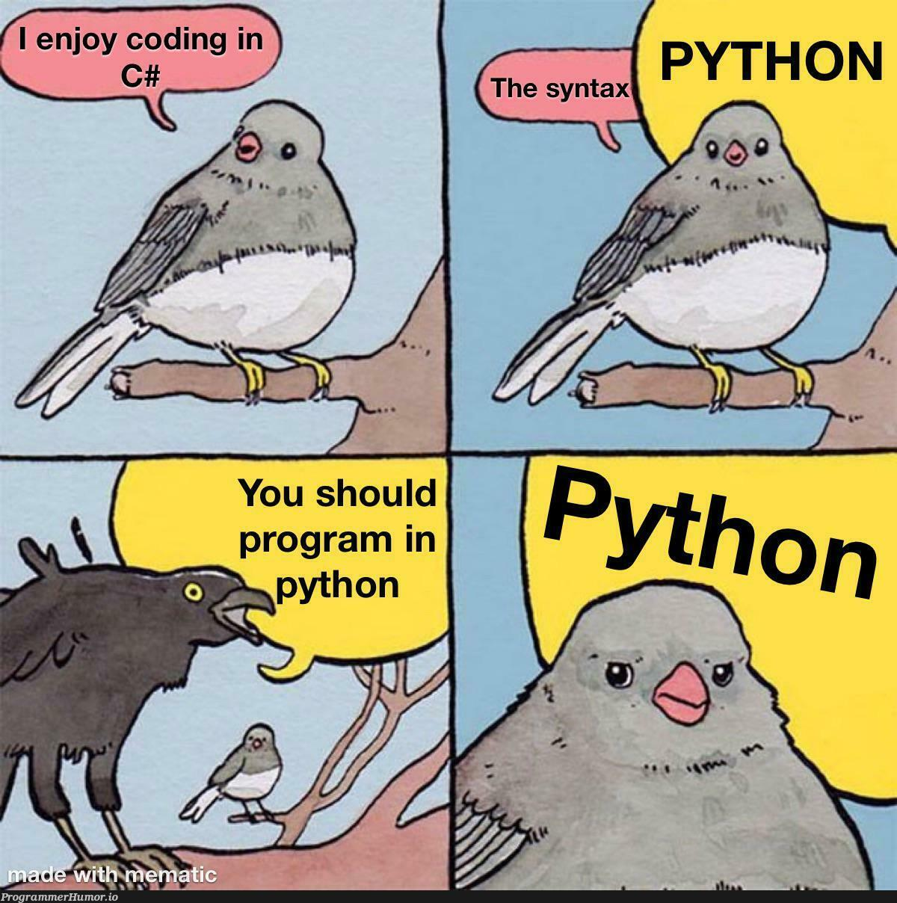

Variables
=========================
A variable stores a **reference** to a value.

Created by assignment:

```python
name = "Alice"
age = 20
height = 1.75
```

Rules:
- Start with a letter or `_`
- Letters, digits, underscores allowed
- Case‑sensitive: `count` ≠ `Count`

---

Data Types
=========================

### int  
Whole numbers, positive or negative.  
Example:  
```python
age = 25
```

### float  
Decimal numbers.  
```python
pi = 3.14
```

### str  
Text data in quotes.  
```python
city = "Baku"
```

### bool  
Logical values: `True` or `False`.  
```python
is_student = True
```

### NoneType  
Represents “no value”.  
```python
result = None
```

---

Input & Output
=========================
<!-- column_layout: [1, 2, 1] -->

<!-- column: 0 -->
### Output (stdout)
```python +exec
name = "ElnurBDa"
print("Hello")
print("User:", name)
print(f"The F String is used by {name}")
```

<!-- column: 1 -->

<!-- column: 2 -->
### Input (stdin)
```python
name = input("Enter your name: ")
```

`input()` **always** returns `str`.

Convert for numeric use:
```python
age = int(input("Enter age: "))
```
<!-- reset_layout -->

---

Arithmetic Operators
=========================

<!-- column_layout: [1,1] -->

<!-- column: 0 -->
### Operator Summary
```
+   addition
-   subtraction
*   multiplication
/   division (float)
//  floor division (drops decimals)
%   remainder
**  exponent
```

<!-- column: 1 -->
### Examples
```python
10 + 3   # 13
10 - 3   # 7
10 * 3   # 30
10 / 3   # 3.333...
10 // 3  # 3
10 % 3   # 1
2 ** 3   # 8
```

<!-- reset_layout -->

---

Comparison Operators
=========================

```python
x == y   # equal
x != y   # not equal
x > y
x < y
x >= y
x <= y
```

Example:
```python
score = 85
score >= 90   # False
score < 100   # True
```

---

Logical Operators
=========================

```python
and   # both conditions True
or    # at least one True
not   # reverses boolean
```

Example:
```python
age = 20
has_id = True

age >= 18 and has_id   # True
age < 18 or has_id     # True
not has_id             # False
```

---

Assignment Operators
=========================

Shorthand updates:

```python
x = 5
x += 2   # 7
x -= 1   # 6
x *= 3   # 18
x /= 2   # 9.0
```

Used often in loops and accumulations.

---

Type Casting (Conversion)
=========================

Convert between types:

```python
int("10")      # 10
float("3.14")  # 3.14
str(123)       # "123"
bool("hi")     # True
bool("")       # False
```

Used for:
- numeric input  
- formatting  
- arithmetic  

---

Example
=============================

```python {all|1-2|4-6|8-9} +line_numbers 
name = input("Enter your name: ")
age = int(input("Enter your age: "))

next_age = age + 1    
is_adult = age >= 18 
message = f"{name}, next year you will be {next_age}."

print(message)
print("Adult status:", is_adult)
```

---

Mini Task
============================

<!-- column_layout: [1, 2] -->
<!-- column: 0 -->
Create a script that:

1. Asks for two numbers  
2. Converts them to integers  
3. Calculates:
   - sum  
   - difference  
   - product  
4. Prints results

<!-- column: 1 -->

<!-- reset_layout -->

---

<!-- end_slide -->
<!-- font_size: 5 -->
<!-- alignment: center -->
<!-- jump_to_middle -->

# Thanks!

<!-- font_size: 1 -->

#### By ElnurBDa
