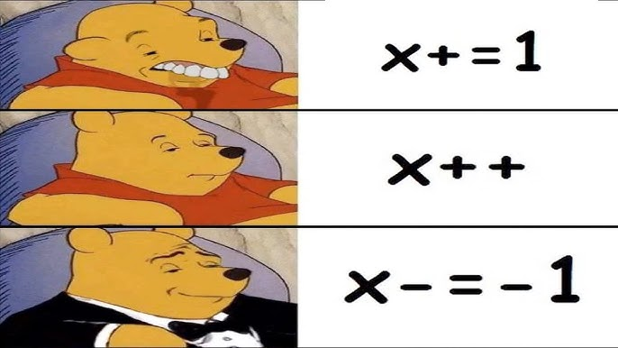

Control Flow — Overview
=======================
Control flow decides **how a program behaves**:

- Conditional statements  
- Logical operators  
- Loops (`for`, `while`)  
- Loop control (`break`, `continue`, `pass`)

This module teaches how Python makes decisions and repeats actions.

---

Conditional Statements
======================

Basic structure:

```python
if condition:
    block
```

A condition must evaluate to **True** or **False**.

Example:

```python +exec
age = 20
if age >= 18:
    print("Adult")
```

---

if / else
==========

```python
if condition:
    action_if_true
else:
    action_if_false
```

Example:

```python +exec
temperature = 10

if temperature > 15:
    print("Warm")
else:
    print("Cold")
```

---

if / elif / else
================

Used when multiple conditions must be checked in order.

```python +exec
grade = "?"
score = 75

if score >= 90:
    grade = "A"
elif score >= 80:
    grade = "B"
elif score >= 70:
    grade = "C"
else:
    grade = "D"

print(grade)
```

---

Logical Operators in Conditions
===============================

```python
and   # both True
or    # one True
not   # invert
```

Examples:

```python
age = 20
has_id = True

age >= 18 and has_id
age < 18 or has_id
not has_id
```

---

Nested Conditions
=================

```python +exec
age = 25
citizen = True

if age >= 18:
    if citizen:
        print("Eligible")
    else:
        print("Not eligible")
```

Avoid deep nesting when possible.

---

for Loop — Basics
==================

Iterates over a sequence:

```python +exec
for x in [1, 2, 3]:
    print(x)
```

Strings:

```python +exec
for char in "Python":
    print(char)
```

---

for Loop with range()
=====================

```python +exec
for i in range(5):
    print(i)
```

Custom range:

```python +exec
for i in range(2, 10, 2):
    print(i)
```

---

while Loop
==========

Repeats while a condition is **True**.

```python +exec
count = 0
while count < 5:
    print(count)
    count += 1
```

---

Loop Control — break
====================

Stops the loop immediately.

```python +exec
for i in range(10):
    if i == 5:
        break
    print(i)
```

---

Loop Control — continue
=======================

Skips current iteration.

```python +exec
for i in range(5):
    if i % 2 == 0:
        continue
    print(i)
```

---

Loop Control — pass
===================

`pass` does nothing — placeholder.

```python +exec
for i in range(3):
    pass
```

---

Loop Patterns & Comprehensions
==============================

Often we use loops to **build new lists** from old ones.

Classic pattern:

```python +exec
nums = [1, 2, 3, 4, 5]
evens = []

for n in nums:
    if n % 2 == 0:
        evens.append(n)

print("evens:", evens)
```

Same logic using a **list comprehension** (from Module 3):

```python +exec
nums = [1, 2, 3, 4, 5]
evens = [n for n in nums if n % 2 == 0]
print("evens:", evens)
```

Use whichever is **clearer** to you and your team; for multiple complex steps, prefer the classic loop.

---

Example
===========================

```python {all|1|3-7|4-5|6-7|9} +line_numbers +exec 
total = 0

for i in range(1, 6):
    if i % 2 == 0:
        total += i
    else:
        continue

print("Sum of even numbers:", total)
```

---

Mini Task
============================

<!-- column_layout: [1, 2] -->
<!-- column: 0 -->
Write a script that:

1. Asks the user for a number  
2. Prints all numbers from 1 to that number  
3. Prints only **even numbers**  
4. Skips odd numbers using `continue`  
5. Stops entirely if number exceeds 100 using `break`  

<!-- column: 1 -->

<!-- reset_layout -->
---

Why Refactor to Functions?
==========================

Example of a script **without** functions:

```python
scores = [80, 95, 60, 70]

total = 0
for s in scores:
    total += s
average = total / len(scores)
print("Average:", average)

passed = 0
for s in scores:
    if s >= 70:
        passed += 1
print("Passed:", passed)
```

Problems:

- Harder to reuse logic with other lists  
- No clear names for key operations  

We’ll refactor step by step.

---

Step 1 — Wrap Logic in a Function
=================================

```python +exec
def average(scores):
    total = 0
    for s in scores:
        total += s
    return total / len(scores)

scores = [80, 95, 60, 70]
print("Average:", average(scores))
```

Benefits:

- Name `average` describes intent  
- Easy to test with different lists  

Try writing `count_passed(scores, threshold)` in the same style.

---

Step 2 — Use Existing Constructs
================================

After writing the basic function with a loop, you can improve it:

```python +exec
def average(scores):
    return sum(scores) / len(scores)

def count_passed(scores, threshold=70):
    passed = 0
    for s in scores:
        if s >= threshold:
            passed += 1
    return passed

scores = [80, 95, 60, 70]
print("Average:", average(scores))
print("Passed:", count_passed(scores))
```

Pattern:

1. Make it work  
2. Make it **clear**  
3. Only then make it shorter if it’s still readable  

---

Mini Practice — Refactor Temperature Script
===========================================

Take a plain script like:

```python
temps = [20, 25, 18, 30]

for t in temps:
    if t > 25:
        print(t, "Hot")
    else:
        print(t, "OK")
```

Refactor into:

- `label_temp(t)` → returns `"Hot"` or `"OK"`  
- `print_labeled_temps(temps)` → loops and prints  

---

Separating Concerns — Input vs Logic vs Output
==============================================

Good structure:

```python +exec
def read_scores():
    raw = input("Enter scores separated by commas: ")
    parts = raw.split(",")
    return [int(p.strip()) for p in parts]

def compute_average(scores):
    return sum(scores) / len(scores)

def main():
    scores = read_scores()
    avg = compute_average(scores)
    print("Average:", avg)

if __name__ == "__main__":
    main()
```

Roles:

- `read_scores` → input parsing  
- `compute_average` → pure calculation  
- `main` → wiring everything together  

---

Mini Project — Number Analyzer
==============================

Create `number_analyzer.py` that:

1. Has a `read_numbers()` function that reads a comma‑separated line and returns a list of `int`.  
2. Has `summary_stats(numbers)` that returns a dict with:
   - `count`, `min`, `max`, `average`  
3. Has `print_report(stats)` that prints a formatted summary.  
4. Uses a `main()` function plus the `if __name__ == "__main__":` pattern.  

You’ll reuse this style when you move to multiple files and modules next.

---


