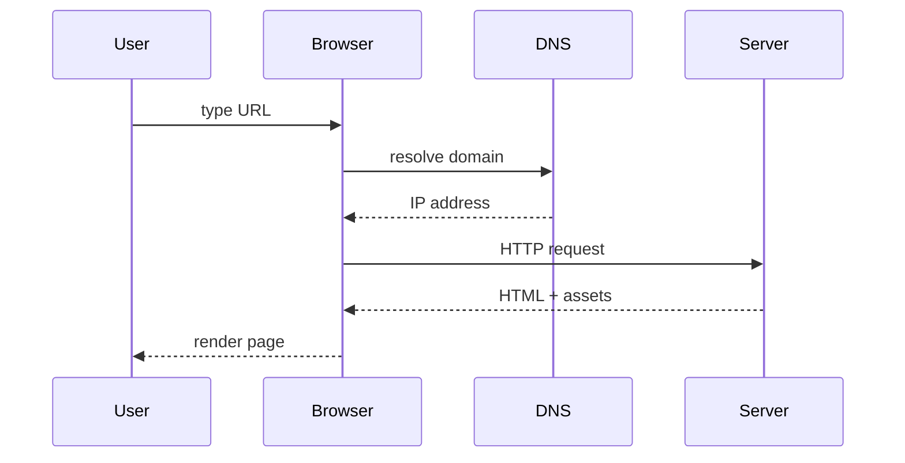

Module 8 — Web Basics
=====================
We connect Python skills to the web stack:

- What happens when you open a URL
- HTML structure & tags
- HTTP requests/responses
- APIs & JSON payloads
- Consuming APIs with `requests`
- Serving static pages with Python

---

How the Web Works
=================
Workflow from browser to server:

1. User enters `https://example.com`
2. Browser resolves domain → IP
3. Browser sends HTTP request
4. Server responds with HTML, CSS, JS
5. Browser renders page



---

HTML — Building Blocks
======================
HTML describes structure/content of web pages (like blueprints of a house).

```html
<!DOCTYPE html>
<html lang="en">
  <head>
    <meta charset="UTF-8" />
    <title>Hello Web</title>
  </head>
  <body>
    <h1>Welcome!</h1>
    <p>This is my first web page.</p>
    <a href="https://python.org">Python.org</a>
  </body>
</html>
```

- Tags usually come in pairs: `<tag>content</tag>`
- Attributes add metadata: `<a href="https://python.org">`
- Browser builds the **DOM tree** from these nested tags

---

HTML Storyboard: Code → Server → Browser
========================================
1. **Write HTML** (`index.html`)
2. **Serve it** (`python3 -m http.server 8000`)
3. **View in browser** (`http://localhost:8000`)

```text
[index.html] --(http.server)--> [localhost:8000] --(render)--> [Page]
```

Focus questions:
- Do tags nest correctly? (`<main>` contains `<section>`)
- Did you include `alt` text for images?
- Can you describe each section aloud?

---

HTML Document Anatomy
=====================

| Section     | Purpose                                  |
|-------------|------------------------------------------|
| `<!DOCTYPE>`| Tells browser to use modern HTML5 rules  |
| `<html>`    | Root element wrapping everything         |
| `<head>`    | Metadata, title, linked CSS/JS           |
| `<body>`    | Visible content: text, images, forms     |

Example with more tags:

```html
<body>
  <header><h1>Cyber Café</h1></header>
  <main>
    <section>
      <h2>Menu</h2>
      <ul>
        <li><strong>Espresso</strong> — 3 AZN</li>
        <li><strong>Tea</strong> — 2 AZN</li>
      </ul>
    </section>
    
  </main>
  <footer>&copy; 2025 Cyber Café</footer>
</body>
```

---

Core HTML Tags & Patterns
=========================

| Tag      | What it does                          | Example snippet                    |
|----------|---------------------------------------|------------------------------------|
| `<h1>`   | Page title                            | `<h1>News</h1>`                    |
| `<p>`    | Paragraph                             | `<p>Breaking updates...</p>`       |
| `<a>`    | Link to another page/file             | `<a href="/about.html">About</a>`  |
| ``  | Display image                         | ``|
| `<ul>/<ol>` | Lists (unordered/ordered)         | `<ul><li>Item</li></ul>`           |
| `<form>` | User input                            | `<form><input name="email" /></form>`|
| `<div>`/`<span>` | Layout/grouping               | `<div class="card">...</div>`      |

Tip: Start simple, add CSS later to style it.

---

Styling with CSS
================
CSS (Cascading Style Sheets) controls presentation.

Ways to include CSS:
- Inline: `<p style="color:red">`
- `<style>` block in `<head>`
- External file: `<link rel="stylesheet" href="styles.css" />`

Example:

```html
<head>
  <link rel="stylesheet" href="assets/styles.css" />
</head>
<body>
  <h1 class="hero">Welcome</h1>
</body>
```

```css
.hero {
  color: #ff9900;
  text-align: center;
  border-bottom: 2px solid #444;
}
```

Guideline: keep structure (HTML) separate from style (CSS) for clarity.

---

JavaScript in HTML
==================
JavaScript brings interactivity.

Common patterns:
- Inline handlers: `<button onclick="alert('Hi')">`
- `<script>` tag inside HTML file
- External file: `<script src="app.js"></script>`

Example:

```html
<body>
  <p id="greeting">Loading...</p>
  <button id="btn">Say hi</button>

  <script>
    const message = "Hello from JS!";
    document.getElementById("btn").addEventListener("click", () => {
      document.getElementById("greeting").textContent = message;
    });
  </script>
</body>
```

Place scripts near the end of `<body>` so HTML loads before JS runs.

---

Serving `index.html` Quickly
============================
Browsers look for `index.html` by default.

```bash
cd website_project
python3 -m http.server 8000
```

- Place `index.html` alongside the command
- Visit http://localhost:8000 to see it rendered
- Great for checking static prototypes before moving to frameworks

Challenge: create `index.html` with header, paragraph, list, and image, then serve it locally.

---

HTTP — The Conversation Rules
=============================
HTTP (HyperText Transfer Protocol) defines how clients & servers talk — like a script both sides follow.

Structure:

```http
<METHOD> <PATH> HTTP/1.1
Header: Value
Header: Value

<optional body>
```

Request example:
```http
GET /api/users HTTP/1.1
Host: example.com
User-Agent: Mozilla/5.0
Accept: application/json
```

Response example:
```http
HTTP/1.1 200 OK
Content-Type: application/json

{"status": "ok", "count": 2}
```

Common verbs:
- `GET` (read), `POST` (create), `PUT/PATCH` (update), `DELETE` (remove)

---

HTTP Anatomy — Request vs Response
==================================
<!-- column_layout: [1,1] -->
<!-- column: 0 -->
**Request**
```http
POST /login HTTP/1.1
Host: mysite.com
Content-Type: application/json
Authorization: Bearer <token>

{"email": "user@example.com", "password": "***"}
```
- Method + path
- Headers describe metadata (auth, format)
- Body carries data (optional)

<!-- column: 1 -->
**Response**
```http
HTTP/1.1 200 OK
Content-Type: application/json
Set-Cookie: session=abc123

{"status": "ok", "message": "Welcome"}
```
- Status line communicates result
- Headers for caching, cookies, etc.
- Body returns JSON/HTML/binary
<!-- reset_layout -->

---

Status Codes
============

| Code | Meaning            | Use case                       |
|------|--------------------|--------------------------------|
| 200  | OK                 | Successful request             |
| 201  | Created            | Resource created (POST)        |
| 301  | Moved Permanently  | Redirect                       |
| 400  | Bad Request        | Invalid client data            |
| 401  | Unauthorized       | Missing/invalid auth           |
| 404  | Not Found          | Resource missing               |
| 500  | Internal Server Error | Server bug/problem        |

Fun reference with cat photos: https://http.cat

---

APIs — Digital Waiters
======================
API = Application Programming Interface.

- Think of a restaurant: you (client) tell the waiter (API) what you want, they talk to the kitchen (server), and bring back the dish (data).
- HTTP APIs expose data/actions via URLs, verbs, and JSON payloads.
- Good APIs document their menu (endpoints, parameters, status codes).

Example: [ExchangeRate API](https://exchangerate.host/#/)

| Endpoint              | Method | Description             |
|-----------------------|--------|-------------------------|
| `/latest?base=USD`    | GET    | Latest currency rates   |
| `/convert?from=USD...`| GET    | Convert amount          |
| `/timeseries?...`     | GET    | Historical data         |

Menu analogy:
- Endpoint = dish name
- Query params = customization
- Response JSON = meal you receive

---

JSON — Data Containers
======================
JSON (JavaScript Object Notation) represents structured data with nested objects/lists.

```json
{
  "id": 42,
  "username": "admin",
  "scores": [99, 88, 91],
  "profile": {
    "city": "Baku",
    "active": true
  }
}
```

Analogy: dictionaries + lists combined.

Rules of thumb:
- Keys in double quotes, values can be string/number/bool/null/object/array
- Order usually not important, whitespace ignored

Another sample (array of objects):

```json
[
  {"task": "learn HTML", "done": true},
  {"task": "build API client", "done": false}
]
```

Analogy: shipping boxes inside a truck — arrays hold boxes, each box (object) has labeled compartments (keys).

---

Inspecting APIs
===============
Tools:

- Browser dev tools → Network tab
- `curl` in terminal:
```bash
curl -X GET "https://api.exchangerate.host/latest"
```
- Postman, Bruno, or Insomnia for graphical testing

Always check: URL, method, headers, body, response code, payload.

---

Python `requests` Basics
========================

```python +exec
import requests

url = "https://api.exchangerate.host/latest?base=USD"
response = requests.get(url, timeout=5)

print("Status:", response.status_code)
data = response.json()
print("EUR rate:", data["rates"]["EUR"])
```

Notes:
- `timeout` prevents hanging forever
- Use `response.raise_for_status()` to throw for errors
- `response.text` vs `response.json()` depending on content type

---

Checkpoint — Your First API Call
================================
1. Activate your venv
2. `pip install requests`
3. Run:
```python
import requests
data = requests.get("https://api.exchangerate.host/latest", timeout=5).json()
print("Base:", data["base"])
print("AZN rate:", data["rates"]["AZN"])
```
4. Screenshot output for homework

Questions to consider:
- What happens if you forget `.json()`?
- How would you handle a missing key?

---

Installing `requests` Inside a venv
===================================

```bash
python3 -m venv .venv
source .venv/bin/activate  # Windows: .venv\Scripts\activate
pip install --upgrade pip
pip install requests
pip freeze
```

- Always isolate dependencies per project
- `pip freeze` helps document versions (`requirements.txt`)
- Deactivate with `deactivate` when done

---

Sending Data with `requests`
============================

```python +exec
import requests

payload = {"username": "Elnur", "score": 95}

resp = requests.post(
    "https://httpbin.org/post",
    json=payload,
    headers={"Authorization": "Bearer TOKEN"},
    timeout=5,
)

print("Server echoed:", resp.json()["json"])
```

`json=...` auto converts dict to JSON & sets `Content-Type: application/json`.

---

Serving Static HTML with Python
===============================
Quick demo using built-in `http.server`.

```bash
python3 -m http.server 8000
```

- Serves current directory
- Visit http://localhost:8000 to view files
- Great for testing HTML/CSS locally

Stop with `Ctrl+C`.

---

Custom Minimal Server
=====================
Serve a specific HTML file with Python.

```python +exec
from http.server import SimpleHTTPRequestHandler, HTTPServer
from pathlib import Path

PORT = 8080
ROOT = Path("website")

class StaticHandler(SimpleHTTPRequestHandler):
    def translate_path(self, path):
        # Map requests into our ROOT directory
        return str(ROOT / path.lstrip("/"))

if __name__ == "__main__":
    ROOT.mkdir(exist_ok=True)
    httpd = HTTPServer(("0.0.0.0", PORT), StaticHandler)
    print(f"Serving on http://localhost:{PORT}")
    httpd.serve_forever()
```

Place `index.html` inside `website/` and run script.

Explanation:
- `HTTPServer` listens on port 8080 and waits for requests
- `SimpleHTTPRequestHandler` knows how to serve files; we override `translate_path` to force it into `website/`
- `ROOT.mkdir(exist_ok=True)` ensures the folder exists before serving
- Visit http://localhost:8080/index.html to test

Project structure reference:
```
website/
├── index.html
├── about.html
└── assets/
    └── styles.css
server.py
```
Run `python server.py` from the folder containing `website/`.

---

Mini Project
============
Build a simple dashboard:

1. Create `index.html` displaying latest crypto price.
2. Write `fetch_price.py` that uses `requests` to fetch JSON from a public API.
3. Save data to `data.json`.
4. Serve folder via `python -m http.server`.


---

