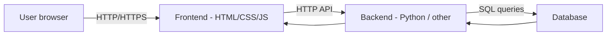
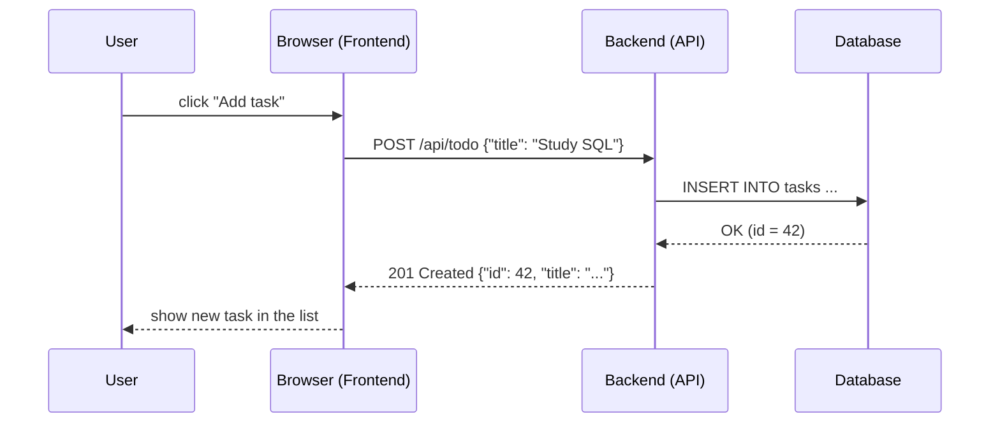

Module 9 — Web App Architecture & To‑Do App
===========================================
In this module we connect everything together in a **simple web application**:

- Basic web application architecture
- Frontend vs backend vs database
- Building a minimal backend for a To‑Do app
- Building a minimal frontend for it
- Extra mini‑project for practice

---

Big Picture — Web Application Architecture
==========================================
Modern web apps are usually split into three main parts:

- **Frontend** — code running in the browser (HTML/CSS/JS)
- **Backend** — server code handling requests and business logic
- **Database** — persistent storage for data



The browser never talks to the database directly — it always goes through the backend.

---

Roles of Frontend, Backend, Database
====================================

| Layer      | Main role                             | Technologies (examples)          |
|-----------:|----------------------------------------|----------------------------------|
| Frontend   | UI, layout, user interactions         | HTML, CSS, JavaScript            |
| Backend    | Logic, validation, security, APIs     | Python, Node, Java, Go, etc.    |
| Database   | Store and query structured data       | SQLite, PostgreSQL, MySQL, etc. |

Analogy:
- Frontend = restaurant dining area & menu
- Backend = kitchen + waiters
- Database = pantry where ingredients are stored

---

Request / Response Flow
=======================
User action → network request → backend → database → response → UI update.



Key idea: **HTTP** is the language between frontend and backend.

---

Designing a Simple To‑Do Backend
================================
We will build a tiny **JSON API** in Python for a To‑Do app.

Features:
- List all tasks
- Create new task
- Mark task as completed

Simplest storage option:
- Start with an **in‑memory list** (lost on restart but easy to understand)
- Later you can swap it with SQLite (from Module 7)

---

To‑Do Backend — Minimal API (Flask)
===================================

`todo_backend.py`

```python +exec
from flask import Flask, jsonify, request

app = Flask(__name__)

tasks = []  # in-memory list of dicts
next_id = 1

@app.get("/api/todo")
def list_tasks():
    return jsonify(tasks)

@app.post("/api/todo")
def create_task():
    global next_id
    data = request.get_json() or {}
    title = data.get("title", "").strip()
    if not title:
        return {"error": "title is required"}, 400

    task = {"id": next_id, "title": title, "completed": False}
    next_id += 1
    tasks.append(task)
    return task, 201

if __name__ == "__main__":
    app.run(debug=True)
```

Run with:

```bash
pip install flask
python todo_backend.py
```

---

Testing the Backend with `curl`
===============================

```bash
# list tasks
curl http://localhost:5000/api/todo

# create a new task
curl -X POST http://localhost:5000/api/todo \
  -H "Content-Type: application/json" \
  -d '{"title": "Finish Module 9 slides"}'
```

Check:
- HTTP method (`GET`, `POST`)
- URL path (`/api/todo`)
- Request body and headers
- Response JSON and status code

---

Optional: Persist To‑Dos with SQLite
====================================
You can reuse **Module 7** knowledge to save tasks in `app.db`.

Sketch:

```sql
CREATE TABLE IF NOT EXISTS tasks (
    id INTEGER PRIMARY KEY AUTOINCREMENT,
    title TEXT NOT NULL,
    completed INTEGER NOT NULL DEFAULT 0
);
```

```python
import sqlite3

def get_conn():
    return sqlite3.connect("app.db")
```

Then inside your Flask handlers, instead of using a global `tasks` list, execute `INSERT`, `SELECT`, and `UPDATE` queries.

---

Building the Frontend — HTML Skeleton
=====================================

`index.html`

```html
<!DOCTYPE html>
<html lang="en">
  <head>
    <meta charset="UTF-8" />
    <title>Mini To-Do App</title>
    <style>
      body { font-family: system-ui, sans-serif; margin: 2rem; background: #1d2021; color: #ebdbb2; }
      h1 { color: #fabd2f; }
      input, button { padding: 0.4rem 0.6rem; margin-right: 0.4rem; }
      ul { list-style: none; padding: 0; }
      li { padding: 0.25rem 0; }
    </style>
  </head>
  <body>
    <h1>Mini To-Do App</h1>
    <input id="title" placeholder="New task..." />
    <button id="add-btn">Add</button>
    <ul id="list"></ul>

    <script src="app.js"></script>
  </body>
  </html>
```

Serve this folder with:

```bash
python3 -m http.server 8000
```

---

Frontend Logic — Fetching Tasks
===============================

`app.js`

```javascript
const API_URL = "http://localhost:5000/api/todo";

async function loadTasks() {
  const res = await fetch(API_URL);
  const data = await res.json();

  const list = document.getElementById("list");
  list.innerHTML = "";
  for (const task of data) {
    const li = document.createElement("li");
    li.textContent = `${task.id}. ${task.title}`;
    list.appendChild(li);
  }
}

loadTasks();
```

Open `http://localhost:8000` in a browser to see the list (empty at first).

---

Frontend Logic — Creating Tasks from UI
=======================================

Extend `app.js`:

```javascript
const input = document.getElementById("title");
const button = document.getElementById("add-btn");

button.addEventListener("click", async () => {
  const title = input.value.trim();
  if (!title) return;

  await fetch(API_URL, {
    method: "POST",
    headers: { "Content-Type": "application/json" },
    body: JSON.stringify({ title }),
  });

  input.value = "";
  await loadTasks();
});
```

Flow:
- User types a title and clicks **Add**
- Browser sends `POST` request to backend
- Backend adds task and returns JSON
- Frontend reloads the list using `loadTasks()`

---

Bringing It All Together
========================

End‑to‑end:

1. Start backend:
   - `python todo_backend.py` → serves `http://localhost:5000/api/todo`
2. Start static frontend server in same folder as `index.html`:
   - `python3 -m http.server 8000`
3. Visit `http://localhost:8000` in browser:
   - Add tasks from UI
   - Confirm requests in **Network** tab of DevTools
4. Observe:
   - Frontend ↔ Backend via HTTP
   - Backend may use in‑memory list or SQLite

You just built a tiny full‑stack application.

---

Mini Project — Student Manager
==============================

Build a mini student management tool that reuses the same architecture:

1. **Backend API**:
   - Endpoints: `GET /api/students`, `POST /api/students`, `PATCH /api/students/<id>`
   - Each student record includes `id`, `name`, `email`, `course`, and `status` (active/inactive)
2. **Database (recommended)**:
   - SQLite table `students` with columns `(id INTEGER PRIMARY KEY, name TEXT, email TEXT UNIQUE, course TEXT, status TEXT)`
   - Seed 3 demo rows for quick testing
3. **Frontend**:
   - Table showing all students (name, course, status badge)
   - Form to add a new student (name, email, course)
   - Button to toggle status between Active / Inactive (calls PATCH)

Stretch ideas:
- Filter students by course or status
- Add simple validation and inline error messages
- Export the current list to JSON for download

---


