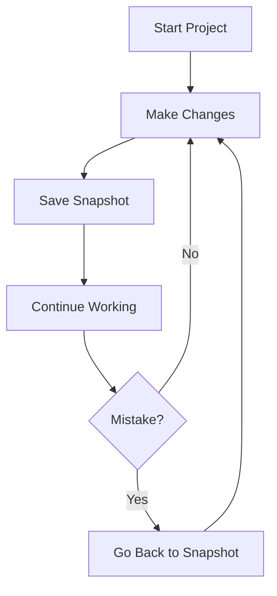
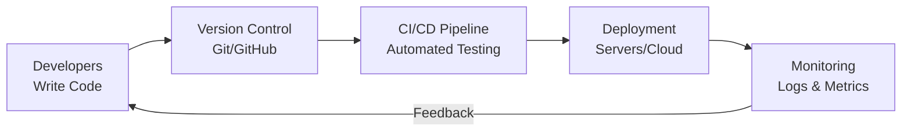
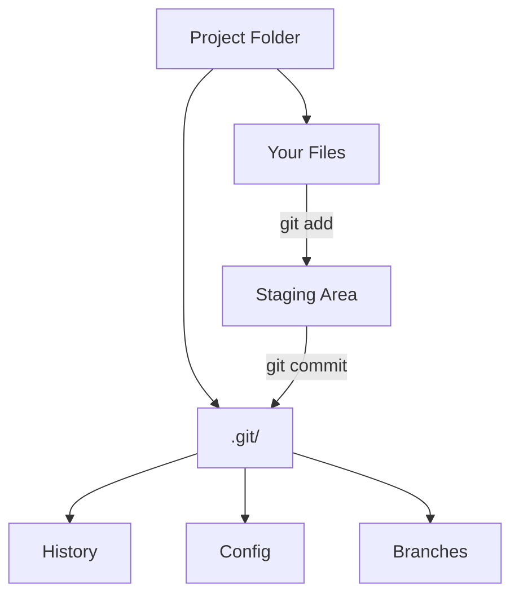
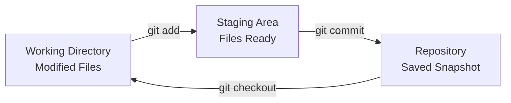
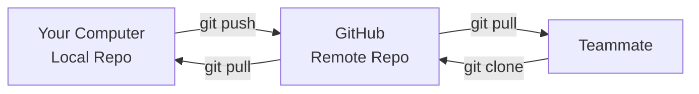
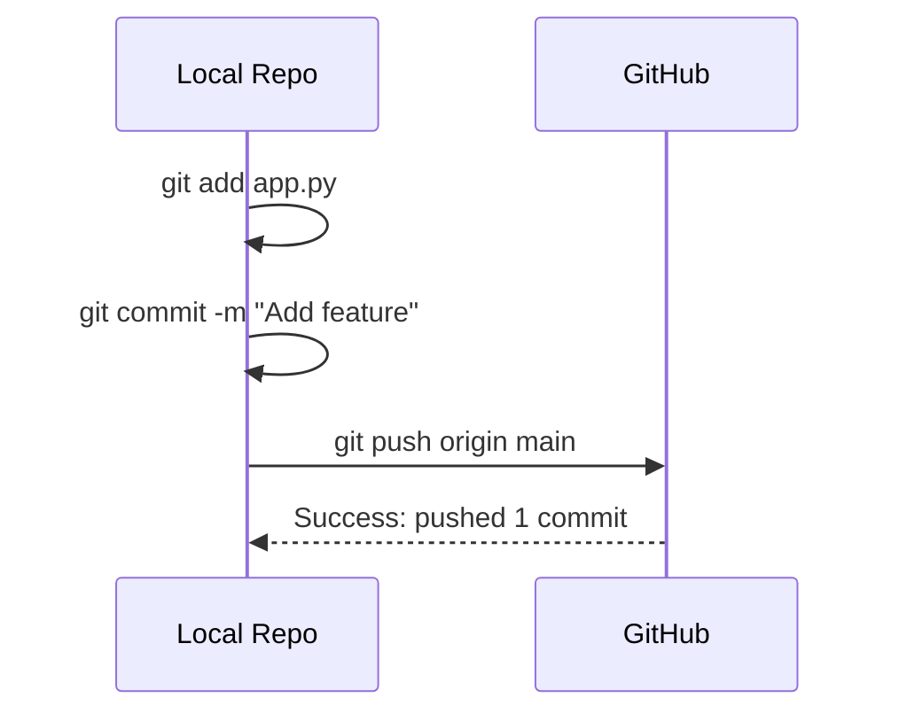
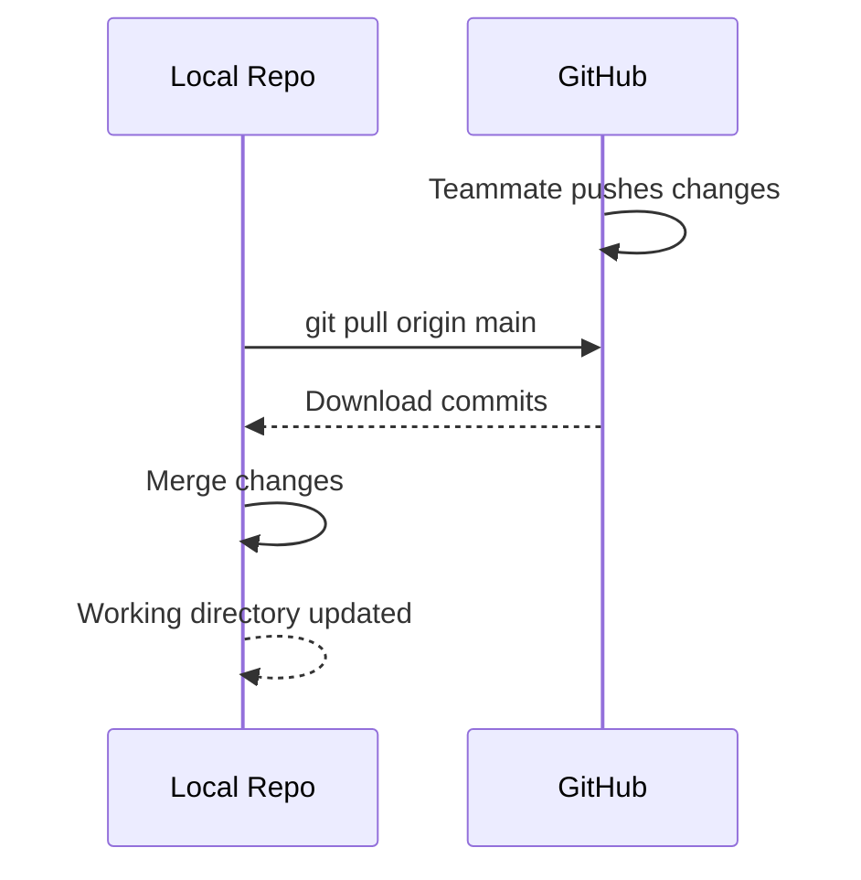
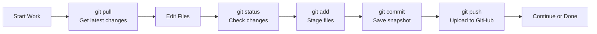

Module — Version Control with Git
==================================
In this module we learn how to **track changes** in our code and **collaborate** with others:

- What is version control and why we need it
- History of Git and its creator
- Git basics and core concepts
- Essential Git commands (add, commit, pull, push)
- What is GitHub and how to use it
- Practical example: pushing a Python app to GitHub

Goal: make your code **safe**, **trackable**, and **shareable**.

---

The Problem: Code Without Version Control
==========================================
Imagine working on a project without Git:

```text
app.py
app_backup.py
app_final.py
app_final_v2.py
app_final_v2_REALLY_FINAL.py
app_old.py
app_working.py
```

Problems:
- **Lost changes** — accidentally deleted code
- **No history** — can't see what changed or why
- **Collaboration chaos** — multiple people editing the same file
- **No rollback** — can't undo mistakes easily

Version control solves all of these problems.

---

What is Version Control?
=========================
**Version control** is a system that tracks changes to files over time.

Think of it like:
- **Time machine** for your code
- **Undo button** that works across days/weeks
- **Collaboration tool** for teams
- **Backup system** that keeps history



Every "snapshot" (commit) saves the entire state of your project at that moment.

---

Why We Need Version Control
============================

<!-- column_layout: [1, 1] -->

<!-- column: 0 -->
**For Individuals:**
- Track what changed and when
- Revert to previous working versions
- Experiment safely (branches)
- Understand your own code evolution

<!-- column: 1 -->
**For Teams:**
- Multiple people work on same codebase
- Merge changes automatically
- See who changed what
- Resolve conflicts systematically

<!-- reset_layout -->

**For Professionals:**
- Required in almost all software jobs
- Essential for DevOps workflows
- Industry standard for code management
- Foundation for CI/CD pipelines

---

The History of Git
==================
Git was created by **Linus Torvalds** in 2005.

**Context:**
- Linux kernel development needed better version control
- Previous tools were slow, proprietary, or expensive
- Needed something **fast**, **distributed**, and **free**

**Design Philosophy:**
- **Distributed** — every copy is a full repository
- **Fast** — optimized for speed
- **Simple** — core concepts are straightforward
- **Open source** — free for everyone

Git became the **de facto standard** for version control in software development.

---

What is DevOps?
===============
**DevOps** = **Dev**elopment + **Op**erations

It's a **culture and set of practices** that bring together software development and IT operations.



**Key Principles:**
- **Automation** — reduce manual work
- **Collaboration** — devs and ops work together
- **Continuous Integration** — merge code frequently
- **Continuous Deployment** — release often and safely

---

Why Git is DevOps
==================
Git is a **foundational DevOps tool** because:

**1. Enables Collaboration**
- Multiple developers work on the same codebase
- Changes are tracked and merged systematically

**2. Supports Automation**
- CI/CD pipelines trigger on Git events (push, pull request)
- Automated tests run when code changes

**3. Provides Traceability**
- Every change is logged with author, date, and message
- Essential for debugging and compliance

**4. Facilitates Deployment**
- Different branches for dev, staging, production
- Rollback to previous versions when needed

**5. Integrates with Tools**
- GitHub, GitLab, Bitbucket (hosting)
- Jenkins, GitHub Actions (automation)
- Docker, Kubernetes (deployment)

---

Git Basics — Repository
========================
A **repository** (repo) is a folder that Git tracks.

Initialize a repository:

```bash
cd my_project
git init
```

This creates a hidden `.git` folder that stores:
- All file versions (history)
- Commit messages
- Branch information
- Configuration



---

Git Basics — Three States
==========================
Files in Git can be in three states:

**1. Working Directory**
- Files you're editing
- Changes not yet staged

**2. Staging Area** (Index)
- Files marked to be committed
- Preview of next commit

**3. Repository** (History)
- Committed snapshots
- Permanent record



Think of it like:
- **Working Directory** = your desk (work in progress)
- **Staging Area** = package ready to ship
- **Repository** = warehouse (permanent storage)

---

Git Command — `git add`
========================
Stage files to be committed.

**Add specific file:**
```bash
git add app.py
```

**Add all files:**
```bash
git add .
```

**Add multiple files:**
```bash
git add app.py config.py utils.py
```

What happens:
- Files move from **Working Directory** → **Staging Area**
- Changes are **prepared** for commit
- You can review what will be committed

Example workflow:

```bash
# Edit app.py
vim app.py

# Stage the changes
git add app.py

# Check status
git status
```

---

Git Command — `git commit`
===========================
Save a snapshot of staged changes.

**Basic commit:**
```bash
git commit -m "Add user authentication"
```

**Commit with description:**
```bash
git commit -m "Fix login bug

- Resolved issue with password validation
- Added error handling for empty fields"
```

What happens:
- Staged files are **saved** to repository
- A **commit** (snapshot) is created
- You get a **unique commit hash** (e.g., `a1b2c3d`)

**Best Practices:**
- Write **clear, descriptive** messages
- Commit **logical units** of work
- Commit **often** (small, frequent commits)

---

Git Command — `git status`
===========================
Check the state of your repository.

```bash
git status
```

Shows:
- **Untracked files** — new files not added yet
- **Modified files** — changed but not staged
- **Staged files** — ready to commit
- **Branch name** — current branch

Example output:

```text
On branch main
Changes not staged for commit:
  (use "git add <file>..." to update what will be committed)
  modified:   app.py

Untracked files:
  (use "git add <file>..." to include in what will be committed)
  config.py

Changes to be committed:
  (use "git reset HEAD <file>..." to unstage)
  new file:   utils.py
```

---

Git Command — `git log`
========================
View commit history.

**Basic log:**
```bash
git log
```

**One-line format:**
```bash
git log --oneline
```

**Graphical view:**
```bash
git log --graph --oneline --all
```

Example output:

```text
a1b2c3d (HEAD -> main) Add user authentication
e4f5g6h Fix login bug
h7i8j9k Initial commit
```

Each commit shows:
- **Hash** — unique identifier
- **Author** — who made the change
- **Date** — when it was made
- **Message** — what changed

---

What is GitHub?
===============
**GitHub** is a **cloud-based hosting service** for Git repositories.

Think of it as:
- **Google Drive** for code
- **Social network** for developers
- **Collaboration platform** for teams
- **Portfolio** for your projects



**Key Features:**
- **Free hosting** for public repositories
- **Web interface** to browse code
- **Pull requests** for code review
- **Issues** for bug tracking
- **Actions** for CI/CD automation

---

Git Command — `git remote`
===========================
Connect your local repo to GitHub.

**Add remote repository:**
```bash
git remote add origin https://github.com/username/repo-name.git
```

**View remotes:**
```bash
git remote -v
```

**Remove remote:**
```bash
git remote remove origin
```

**Change remote URL:**
```bash
git remote set-url origin https://github.com/username/new-repo.git
```

The name `origin` is a **convention** for the main remote repository. You can have multiple remotes (e.g., `origin`, `upstream`).

---

Git Command — `git push`
=========================
Upload your commits to GitHub.

**Push to main branch:**
```bash
git push origin main
```

**First push (set upstream):**
```bash
git push -u origin main
```

**Push all branches:**
```bash
git push --all origin
```

What happens:
- Local commits are **uploaded** to GitHub
- Others can now **see and pull** your changes
- Your code is **backed up** in the cloud



---

Git Command — `git pull`
=========================
Download and merge changes from GitHub.

**Pull from main branch:**
```bash
git pull origin main
```

**Pull and rebase:**
```bash
git pull --rebase origin main
```

What happens:
- **Fetches** latest commits from GitHub
- **Merges** them into your local branch
- Updates your working directory



**Always pull before pushing** to avoid conflicts!

---

Git Command — `git clone`
==========================
Copy a repository from GitHub to your computer.

**Clone a repository:**
```bash
git clone https://github.com/username/repo-name.git
```

**Clone to specific folder:**
```bash
git clone https://github.com/username/repo-name.git my-project
```

**Clone with SSH:**
```bash
git clone git@github.com:username/repo-name.git
```

What happens:
- **Downloads** entire repository
- **Creates** local copy with full history
- **Sets up** remote connection automatically

This is how you:
- **Start** working on existing projects
- **Fork** open-source projects
- **Backup** repositories locally

---

Complete Git Workflow
======================
Typical daily workflow:



**Step-by-step:**

```bash
# 1. Get latest changes
git pull origin main

# 2. Make changes
vim app.py

# 3. Check what changed
git status

# 4. Stage changes
git add app.py

# 5. Commit
git commit -m "Add new feature"

# 6. Push to GitHub
git push origin main
```

---

Practical Example — Setting Up a Project
==========================================
Let's create a simple Python app and push it to GitHub.

<!-- column_layout: [1, 1, 1] --> 
<!-- column: 0 -->
**Step 1: Create project locally**

```bash
mkdir my-python-app
cd my-python-app
```

**Step 2: Initialize Git**

```bash
git init
```
<!-- column: 1 -->

**Step 3: Create app.py**

```python
def greet(name):
    """Greet a user by name."""
    return f"Hello, {name}! Welcome to Python."

def main():
    name = input("Enter your name: ")
    message = greet(name)
    print(message)

if __name__ == "__main__":
    main()
```
<!-- column: 2 -->

**Step 4: Create README.md**

```markdown
# My Python App

A simple greeting application.

## Usage

```bash
python app.py
```
<!-- reset_layout -->

---

Practical Example — First Commit
==================================
<!-- column_layout: [1, 1] --> 
<!-- column: 0 -->
**Step 5: Stage and commit**

```bash
# Add all files
git add .

# Check status
git status

# Make first commit
git commit -m "Initial commit: Add greeting app"
```
<!-- column: 1 -->

**Step 6: View history**

```bash
git log --oneline
```

Output:
```text
a1b2c3d (HEAD -> main) Initial commit: Add greeting app
```
<!-- reset_layout -->
Your code is now **tracked locally** with Git!

---

Practical Example — Push to GitHub
===================================
**Step 7: Create repository on GitHub**

1. Go to github.com
2. Click **"New repository"**
3. Name it `my-python-app`
4. **Don't** initialize with README (we already have one)
5. Click **"Create repository"**

**Step 8: Connect and push**

```bash
# Add GitHub as remote
git remote add origin https://github.com/yourusername/my-python-app.git

# Push to GitHub
git push -u origin main
```

**Step 9: Verify**

- Visit `https://github.com/yourusername/my-python-app`
- You should see `app.py` and `README.md`
- Your code is now **on GitHub**!

---

Practical Example — Making Changes
===================================
<!-- column_layout: [3, 2] --> 
<!-- column: 0 -->
**Step 10: Update the app**

Edit `app.py`:

```python
def greet(name, language="en"):
    """Greet a user by name in different languages."""
    greetings = {
        "en": f"Hello, {name}! Welcome to Python.",
        "es": f"¡Hola, {name}! Bienvenido a Python.",
        "fr": f"Bonjour, {name}! Bienvenue à Python."
    }
    return greetings.get(language, greetings["en"])

def main():
    name = input("Enter your name: ")
    lang = input("Language (en/es/fr): ").lower() or "en"
    message = greet(name, lang)
    print(message)

if __name__ == "__main__":
    main()
```
<!-- column: 1 -->

**Step 11: Commit and push changes**

```bash
git add app.py
git commit -m "Add multi-language support"
git push origin main
```

Your changes are now **on GitHub**!
<!-- reset_layout -->

---

Git Configuration — First Time Setup
======================================
Before your first commit, configure Git:
<!-- column_layout: [1, 1] --> 
<!-- column: 0 -->
**Set your name:**
```bash
git config --global user.name "Your Name"
```

**Set your email:**
```bash
git config --global user.email "your.email@example.com"
```
<!-- column: 1 -->

**Check configuration:**
```bash
git config --list
```

**View specific setting:**
```bash
git config user.name
```
<!-- reset_layout -->
These settings are used in **every commit** to identify the author.

**Note:** Use the **same email** as your GitHub account for proper attribution.

---

Mini Task — Git Practice
==========================

Create an app (or reuse one) and manage it with Git:

**Part 1: Local Setup**
1. Create folder `some-app`
2. Initialize Git repository
3. Create `some.py` with basic operations
4. Create `README.md` with usage instructions
5. Make initial commit

**Part 2: GitHub Setup**
1. Create repository on GitHub
2. Connect local repo to GitHub
3. Push your code

**Part 3: Enhancements**
1. Add a new feature (e.g., power operation)
2. Commit the change
3. Push to GitHub
4. View your commit history on GitHub

**Part 4: Documentation**
1. Update `README.md` with the new feature
2. Commit and push
3. Verify changes on GitHub

**Goal:** Practice the complete Git workflow from local to GitHub.

---

<!-- end_slide -->
<!-- font_size: 5 -->
<!-- alignment: center -->
<!-- jump_to_middle -->

# Thanks!

<!-- font_size: 1 -->

#### By ElnurBDa
