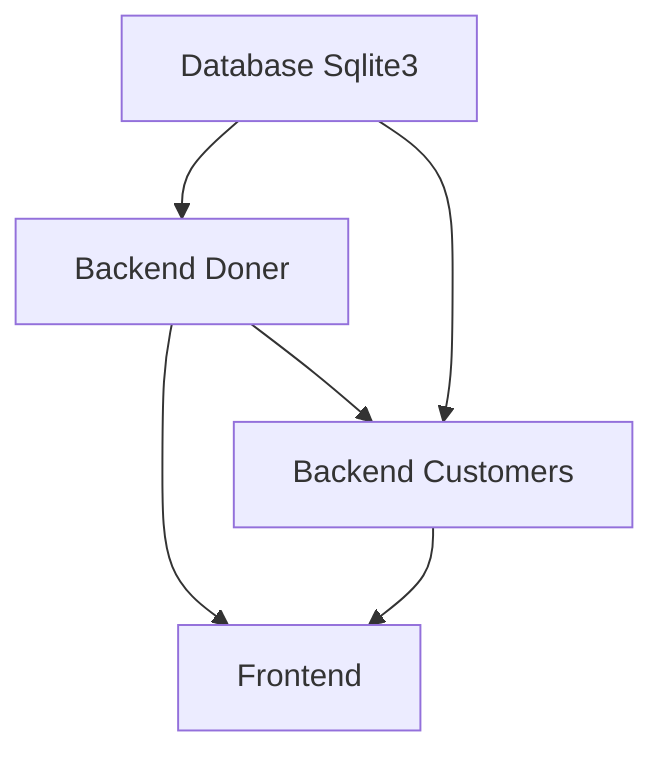
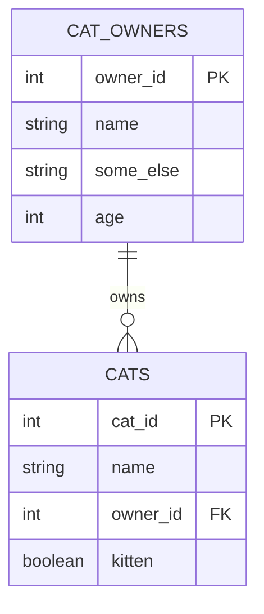

The Final Task: Doner Management
===============

<!-- column_layout: [1, 2, 2] -->

<!-- column: 0 -->



<!-- column: 1 -->

1. **READ**. Investigate how the program works on the diagram. Basically it is a **Doner Management System**. There are some doners to manage(they may have *tomatos*, *ketchup*, *pickles*, *meat type* (chicken, cow, <span style="color:blue;">smurf</span>), and some other ingredients). Customers are the one who gonna eat the doner, for example Dr. Dre or Gargamel. At the end frontend will show, customer preferences regarding Doners. Note: at the end Both Backends access the same Database and Frontend may access both Backends at your wish.

2. **DB**. Design a DB Structure with no Code. The Deliverable will be an image (`structure.png`) (or other presentable format) with the DB Structure. (Check `Reference #1`)

3. **DB**. Prepare `task.sql` with the following queries that will do the things below. You can create a `temp.db` with `sqlite3` and test the queries. (Check `Reference #2`)
    - Create a Doners Table
    - List Doners
    - Insert a Doner
    - Delete a Doner
    - Update a Doner
    - and the same operations for Customers
    - Optional **Bonus**: List Doners and Customers with `JOIN`.

4. **DB+PY**. Create a `db_util.py` that will have a class to work with a Database. (Check `Reference #3` and `Reference #4`) 
    - Constructor takes:
        - sqlite3 db filename
    - A method to create a table Doners
    - A method to list all Doners
    - A method to insert a Doner
    - A method to delete a Doner
    - A method to update a Doner
    - The same methods for Customers
    - Custom methods if the next tasks require. `;)`


<!-- column: 2 -->

5. **PY+Web**. Create a `doner.py`. It will be a CRUD app, that imports class/methods from `db_util.py` and serves it via Flask. (Check `Reference #5`)

6. **PY+Web**. Create a `customer.py`. It will be a CRUD app, that imports class/methods from `db_util.py`, and it has an additional function that sends *API request* to **doner backend** to get all doners and return doners belonging to a specific Customer. (Check `Reference #6` and `Reference #7`)

7. **Web**. A simple HTML Dashboard that gets data from both backends. The below mentioned information should be displayed on the app. Note: the frontend will be served via `python3 -m http.server 8000` (Check `Reference #8`)
    - A table of all Doners. (an API call to **doner backend**)
    - A table of Customers and their Doners. (an API call to **customer backend**)
    - A form to create a Doner
    - A form to create a Customer

8. Push this project into Github. (Check `Reference #9`)

9. **Bonus**. If you successlly finished first seven tasks, then you most probably will get `100`. However, if you are not sure, or you want a much better grade, then do this Bonus task. You should prepare a `cli.py` for managing Doners and Customers.  

<!-- reset_layout -->

You may need to check some guidelines from the next slides.

### Good Luck!

---

Reference #0: Before you start
=============

<!-- column_layout: [1, 1] -->

<!-- column: 0 -->

### The Deliverables

At the end you will submit a Github Link of the project that contains:

- `structure.png`
- `task.sql`
- `db_util.py`
- `doner.py`
- `customer.py`
- `cli.py` (optional)
- `frontend` folder
    - maybe some `html` codes
    - maybe some `css` codes
    - maybe some `js` codes
- `README.MD` - Documentation of the project that has description, date, "how to run it" guide and maybe something else. You are free to use ChatGPT here too to fill this README file.

<!-- column: 1 -->

### Initiation of the Project

Install required python modules:

```bash
python3 -m venv venv
source venv/bin/activate
pip install flask requests
pip freeze > requirements.txt
```

<!-- reset_layout -->

---

Reference #1: DB Structure
=============

A sample program "Cat and Cat owner" may have:


Note: PK - Primary Key; FK - Foreign Key;

---

Reference #2: SQL 
=============

SQL Basics with `Monsters Inc.`:

```sql
CREATE TABLE monsters (
    monster_id INTEGER PRIMARY KEY AUTOINCREMENT,
    name TEXT NOT NULL,
    species TEXT NOT NULL,
    role TEXT,
    scare_power INTEGER,
    employee_of_month INTEGER DEFAULT 0
);

INSERT INTO monsters (name, species, role, scare_power, employee_of_month)
VALUES
('James P. Sullivan', 'Monster', 'Top Scarer', 95, 1),
('Mike Wazowski', 'Monster', 'Assistant Scarer', 65, 0),
('Randall Boggs', 'Monster', 'Scarer', 88, 0),
('Roz', 'Slug Monster', 'Administrator', 40, 0);

SELECT * FROM monsters;

UPDATE monsters
SET scare_power = 75
WHERE name = 'Mike Wazowski';

DELETE FROM monsters
WHERE scare_power < 50;
```

---

Reference #3: Python Class
=============

Frodo could, so you should!

<!-- column_layout: [1, 1] -->

<!-- column: 0 -->

```python
class Fellowship:

    def __init__(self):
        self._members = {}
        self._next_id = 1

    # ---- CREATE ----
    def create_member(self, name, race, role, ring_bearer=False):
        member_id = self._next_id
        self._next_id += 1

        self._members[member_id] = {
            "id": member_id,
            "name": name,
            "race": race,
            "role": role,
            "ring_bearer": ring_bearer,
        }
        return member_id
```
<!-- column: 1 -->

```python
    # ---- READ ----
    def get_member(self, member_id):
        return self._members.get(member_id)

    def list_members(self):
        return list(self._members.values())

    # ---- UPDATE ----
    def update_member(self, member_id, **fields):
        """
        Update allowed fields: name, race, role, ring_bearer
        """
        member = self._members.get(member_id)
        if not member:
            return False

        allowed = {"name", "race", "role", "ring_bearer"}
        for key, value in fields.items():
            if key in allowed:
                member[key] = value
        return True
```

<!-- reset_layout -->

```python
if __name__ == "__main__":
    f = Fellowship()

    frodo_id = f.create_member("Frodo Baggins", "Hobbit", "Ring-bearer", True)
    aragorn_id = f.create_member("Aragorn", "Man", "Ranger")
    gimli_id = f.create_member("Gimli", "Dwarf", "Warrior")

    print(f.list_members())
    f.update_member(aragorn_id, role="King of Gondor")
    f.delete_member(gimli_id)
    print(f.list_members())
```

---

Reference #4: Sqlite3 in Python
=============

After checking this slide you may have a high ground!

```python
import sqlite3

# 1. Open (or create) the database file
conn = sqlite3.connect("star_wars.db")
cursor = conn.cursor()

# 2. Create a table
cursor.execute("""
CREATE TABLE IF NOT EXISTS characters (
    id INTEGER PRIMARY KEY AUTOINCREMENT,
    name TEXT NOT NULL,
    side TEXT NOT NULL
)
""")

# Optional: insert some sample data
cursor.execute("INSERT INTO characters (name, side) VALUES (?, ?)", ("Luke Skywalker", "Light"))
cursor.execute("INSERT INTO characters (name, side) VALUES (?, ?)", ("Darth Vader", "Dark"))
cursor.execute("INSERT INTO characters (name, side) VALUES (?, ?)", ("Leia Organa", "Light"))

conn.commit()

# 3. Get input from user
side_input = input("Enter side (Light or Dark): ")

# 4. Select rows based on user input
cursor.execute(
    "SELECT name FROM characters WHERE side = ?",
    (side_input,)
)

rows = cursor.fetchall()

print("\nCharacters on that side:")
for row in rows:
    print("-", row[0])

# 5. Close the database
conn.close()
```

---

Reference #5: Flask Backend
=============

```python
from flask import Flask, request, jsonify, abort

app = Flask(__name__)
blocks, next_id = {}, 1  # in-memory store

def get_block(i):
    b = blocks.get(i)
    if not b: abort(404, "Block not found")
    return b

@app.get("/blocks")
def list_blocks(): return jsonify(list(blocks.values()))

@app.post("/blocks")
def create_block():
    global next_id
    data = request.get_json(silent=True) or {}
    name = data.get("name"); hardness = data.get("hardness", 1)
    if not name: abort(400, "name required")
    b = {"id": next_id, "name": name, "hardness": hardness}
    blocks[next_id] = b; next_id += 1
    return jsonify(b), 201

@app.get("/blocks/<int:i>")
def read_block(i): return jsonify(get_block(i))

@app.put("/blocks/<int:i>")
def update_block(i):
    b = get_block(i); data = request.get_json(silent=True) or {}
    if "name" in data: b["name"] = data["name"]
    if "hardness" in data: b["hardness"] = data["hardness"]
    return jsonify(b)

@app.delete("/blocks/<int:i>")
def delete_block(i):
    get_block(i); del blocks[i]
    return "", 204

if __name__ == "__main__":
    app.run(debug=True)
```

> How Did We Get Here?

---

Reference #6: API Call
=============

```python
import requests

BASE = "http://127.0.0.1:5000/blocks"

def create(name, hardness):
    r = requests.post(BASE, json={"name": name, "hardness": hardness})
    print("CREATE:", r.json()); return r.json()["id"]

def list_blocks():
    r = requests.get(BASE)
    print("LIST:", r.json())

def read(i):
    r = requests.get(f"{BASE}/{i}")
    print("READ:", r.json())

def update(i, hardness):
    r = requests.put(f"{BASE}/{i}", json={"hardness": hardness})
    print("UPDATE:", r.json())

def delete(i):
    r = requests.delete(f"{BASE}/{i}")
    print("DELETE:", r.status_code)

if __name__ == "__main__":
    block_id = create("stone", 1.5)
    list_blocks()
    read(block_id)
    update(block_id, 2.0)
    delete(block_id)
    list_blocks()
```

> Return to Sender

---

Reference #7: Merging
=============

```python
import requests

books = requests.get("http://127.0.0.1:8080/books").json()
#books = [
#    {"id": 2, "name": "LOTR", "student_id": 3},
#    {"id": 3, "name": "Harry Potter", "student_id": 4}
#]

students = [
    {"id": 3, "name": "Steve"},
    {"id": 5, "name": "Alex"}
]

found = []

for student in students:
    for book in books:
        if book["student_id"] == student["id"]:
            found.append({
                "student_name": student["name"],
                "book_name": book["name"]
            })

for item in found:
    print(f'{item["student_name"]} has a book called {item["book_name"]}.')
```

---

Reference #8: ChatGPT
=============

You are free to use ChatGPT for frontend part only. Because it is not a Frontend Course. However, you should prepare a nice frontend for this project. It will evaluate your Prompt Engineering capabilities.

A sample Prompt:

> This is my Backend Specification, please provide a nice looking Frontend for the app that has the following features: ...

---

Reference #9: Git
=============

To push the code to Github:

```bash
cd project
git init
git add .
git commit -m "done"

# https://github.com/new
# name the repo and ensure it is public

git remote add origin https://github.com/YourUsername/YourRepoName
git branch -M main
git push -u origin main
```

If the last three creates some error, it means you did never practice `git`. So shame on you, and check the internet how authenticate to Github.

---

<!-- end_slide -->
<!-- font_size: 5 -->
<!-- alignment: center -->
<!-- jump_to_middle -->

# Thanks!

<!-- font_size: 1 -->

#### By ElnurBDa
